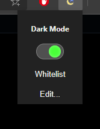

# Simple Dark Mode
*browser extension*

Another dark mode extension for the web, but simplier.
This tiny extension does one thing and one thing only, makes the page dark.

## Goals

This extension aims to provide a sufficient dark mode browsing experience
while doing as little as possible.

The current implementation applies a single svg filter to the entire document
with corrective styling where needed.

## Features

* Real-time enable/disable
* Tab independent settings
* Whitelisting
* Whitelist editing and pattern matching

## Limitations

When a filter is applied to an element, its entire contents is rendered through said filter.
In other words, because we are applying a graphical change rather than a styling inheritance,
the filter cannot be skipped on certain child elements.

Currently, the filter is applied *again* to elements like images, etc.
but the current color matrix has some, err hysteresis if you will.
Additional styling can compensate for the most part but there is quality loss for both
resolution and color space.

It is recommended to whitelist sites for watching videos (i.e. YouTube) as well as any site
providing its own native dark mode.

## TODOs

* The color matrix can be improved
  * I don't know much about color mapping, etc. and thought this was a good start
  * Multiple filter elements may provide a more reliable result
  * Different filters may work better on different pages
    * Probably outside of scope
* Some fonts don't play well with the filter
  * May have to do with their initial color as well
  * Causes lots of fringing, hard to read
